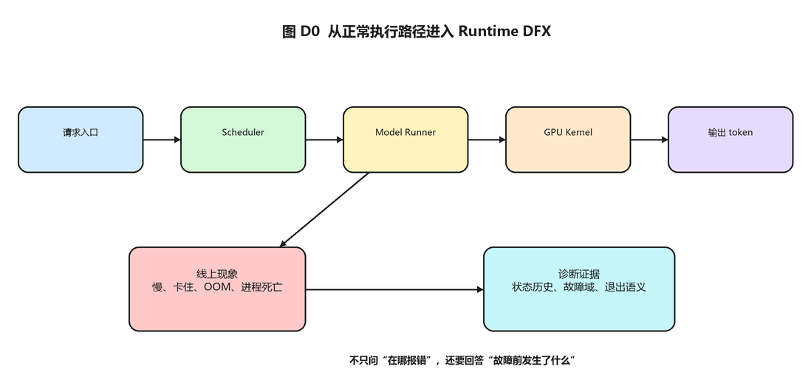
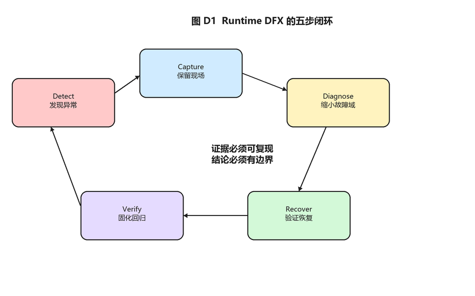
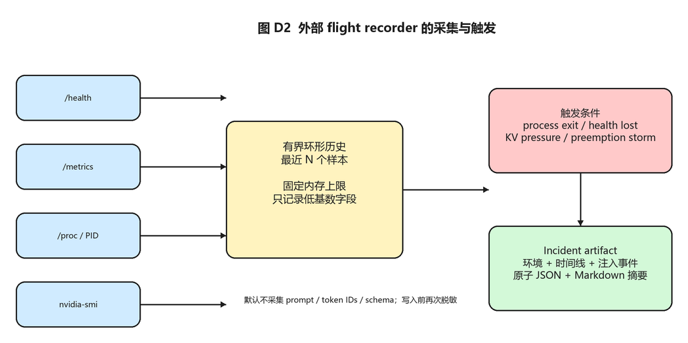
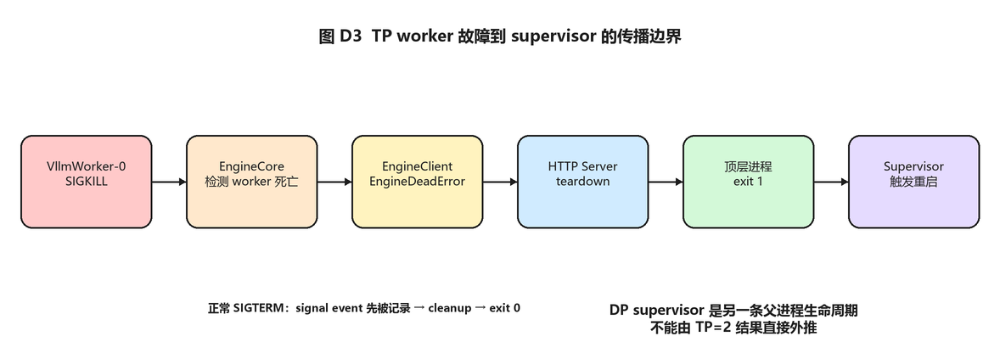
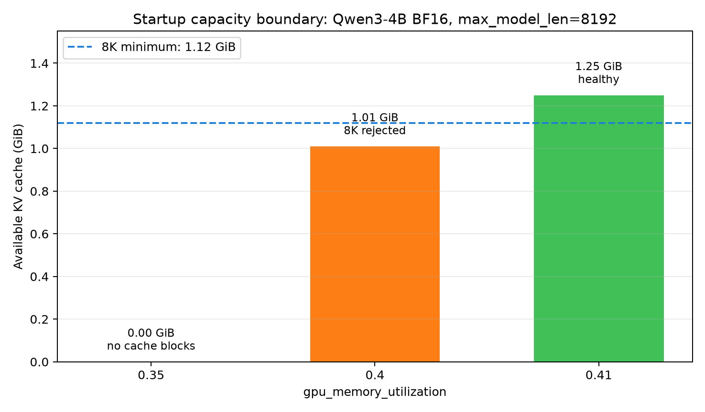
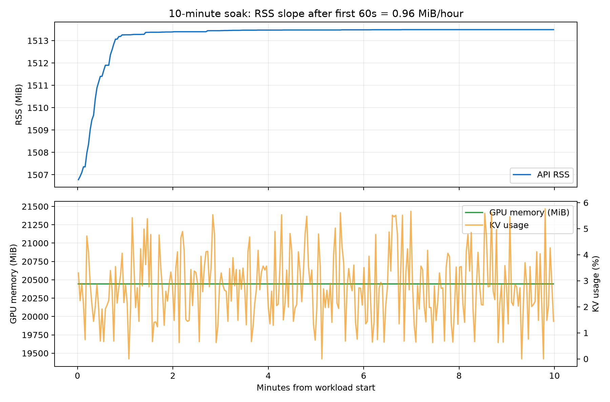
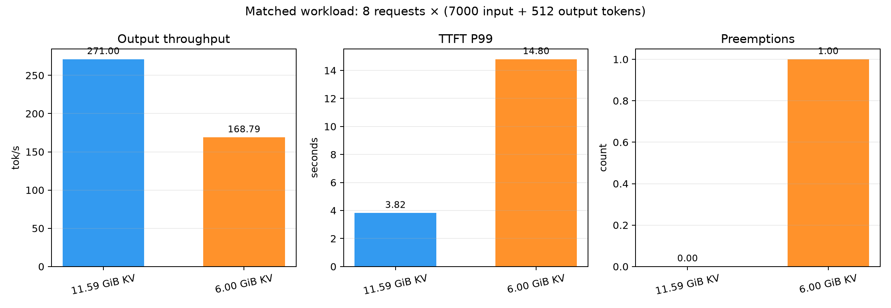

# 从能运行到可诊断：搭一套 vLLM Runtime DFX 实验室

---

> 这是 vLLM 学习系列的第四篇。第一篇沿一个请求走完 Python 主线，第二篇进入 CUDA kernel，第三篇从 PyTorch 到 Triton 实现了 FlashAttention forward。这一篇把视角从正常数据流切到异常状态：当延迟突然升高、KV cache 接近上限、Worker 消失或 EngineCore 死亡时，我们怎样留下足够的证据，而不是只看到一句报错。
>
> 本文不是监控平台使用说明，也不尝试在 vLLM 内自动修复故障。目标是建立一套可复现的 Runtime DFX 方法：发现异常、保留现场、定位故障域、验证恢复语义，最后把结论固化成回归实验。
>
> 完整工具、单测、实验协议和原始结果见 GitHub 仓库 [`vllm-runtime-dfx-lab`](https://github.com/jackLei0901/vllm-runtime-dfx-lab)。核心采集工具只依赖 Python 标准库，可直接放到远程 GPU 实例运行。本文中的 #48966 单卡与 TP=2，以及启动容量边界、抢占对照和 10 分钟短稳结果，均来自真实 RTX 4090 实验。环境快照、原始数据和哈希清单一并保留，正文会明确区分“已经验证”与“仍待验证”。

## 接前三篇：正常路径读完之后，还缺什么

前三篇回答的是一次推理怎样正常完成：请求进入调度器，被整理成 batch，模型执行，KV 写入分页缓存，Attention kernel 读取 K/V，最终产生下一个 token。

但线上故障通常不是以“某个函数写错了”出现，而是以现象出现：

- `/health` 还能返回，但新请求已经无法完成；
- 吞吐变化不大，首个请求却明显变慢；
- 显存没有立即 OOM，但抢占和排队持续上升；
- 一个 TP worker 退出后，API Server 清理完成并返回了退出码 0；
- 服务运行数小时后 RSS 上升，却不确定是缓存、allocator 还是泄漏。

这些问题不能只靠重读正常路径解决。还需要知道故障发生前系统处于什么状态、异常跨过了哪些进程边界、恢复动作是否真的被外部 supervisor 观察到。



> *图 D0：前三篇沿正常执行路径逐层向下；系列四转向异常路径，关注故障前状态、跨进程传播和外部恢复语义。*

正常路径描述“请求如何前进”；DFX 描述“请求为什么不再前进，以及怎样证明”。

## 第 1 站：先定义 DFX，不把它等同于多打日志

DFX 在不同团队里的展开并不统一：有时指 Design for X，也常被用来概括可靠性、诊断和维护能力。本文借用这个缩写表示“面向诊断、恢复和验证的运行时工程”：让故障可以被发现、留证、定位和复验。它不是 vLLM 官方模块名。

我把 Runtime DFX 分成五步：

```text
Detect：发现状态偏离正常范围
Capture：保留故障前后的有限现场
Diagnose：用时间线、故障域和对照组排查
Recover：确认进程、请求和资源怎样恢复
Verify：把结论变成可重复实验或回归测试
```



> *图 D1：Detect、Capture、Diagnose、Recover、Verify 构成闭环。日志和指标只负责其中一部分，最终还要验证进程退出、服务恢复和回归保护。*

日志、指标和 trace 都属于 Capture 手段，不是完整闭环。比如日志里已经出现 `EngineDeadError`，只能证明 API Server 感知了异常；如果顶层进程最后退出 0，systemd 的 `Restart=on-failure` 仍不会拉起服务。此时日志是对的，恢复语义却是错的。

同样，`/health=200` 只说明探针在采样时得到成功响应。它不能代替一次真实 completion，也不能证明 EngineCore、所有 worker 和后续调度循环都健康。

因此每个稳定性实验至少要同时保留四类证据：

| 证据 | 回答的问题 |
| --- | --- |
| 请求结果 | 用户是否真的拿到正确响应 |
| runtime 状态 | running、waiting、KV usage、preemption 如何变化 |
| 进程状态 | 哪个进程先退出、收到什么 signal、是否留下孤儿进程 |
| 外部结果 | 顶层退出码、supervisor 是否重启、恢复用了多久 |

## 第 2 站：vLLM 已经能看到什么，还缺什么

vLLM 已经提供 Prometheus metrics、OpenTelemetry tracing、per-request metrics、KV cache sampled metrics 和异常输入 dump。它们覆盖了大量正常监控需求，新的 DFX 工具不应重新实现一套指标系统。

问题在于，线上诊断常常需要“同一故障前的关联历史”：

- Prometheus 是异步拉取，采样间隔通常远大于一次 scheduler iteration；
- 聚合 counter 能说明发生过抢占，却不能还原哪次 allocation retry 触发了状态变化；
- 完整函数 trace 适合短时定位，不适合常驻。vLLM 文档明确提示 `VLLM_TRACE_FUNCTION=1` 会让 token generation 变慢超过 100 倍；
- crash dump 如果直接携带请求字段，还会产生隐私风险。社区 Issue #47364 就指出 structured-output schema 可能随异常 dump 写入 ERROR 日志。

所以实验室选择一个更窄的目标：

> 不追求记录一切，只保留最近一段时间的低基数状态；当故障出现时，把这些状态与环境、进程和注入事件组成一份可复查证据。

它不是全量 tracing，也不是生产监控的替代品，更接近飞机上的 flight recorder。

这里还有一段值得记住的社区历史。vLLM 曾在 #8305 中加入异常输入 dump，后来因为故障报告者没有提交 dump、功能产生了维护成本，在 PR #12582 中移除；PR #13407 又以脱敏的输入元数据形式重新引入。它说明“能采集”并不自动等于“有诊断价值”。新的 DFX 设计必须回答三个问题：产物由谁使用、它能缩短哪一步排查、收益怎样被验证。

## 第 3 站：先统一证据，再谈自动分析

过去处理一个 Issue 时，server log、benchmark JSON、`nvidia-smi`、退出码和进程树经常分散在不同文件里。信息并非不存在，而是缺少共同的时间轴和字段约定。

实验室先定义一条采样记录（完整定义见 [`schema.py`](https://github.com/jackLei0901/vllm-runtime-dfx-lab/blob/main/src/dfxlab/schema.py)）：

```python
@dataclass(slots=True)
class Sample:
    timestamp: str
    monotonic_seconds: float
    process: dict[str, Any]
    health: dict[str, Any]
    metrics: dict[str, float]
    gpus: list[dict[str, Any]]
    events: list[dict[str, Any]]
```

这里同时保存墙上时间和 monotonic time。墙上时间方便与 server log 对齐；monotonic time 不受系统校时影响，适合计算故障传播和恢复间隔。

指标只选择一小组诊断字段，例如：

```text
num_requests_running
num_requests_waiting
kv_cache_usage_perc
num_preemptions_total
prompt_tokens_total
generation_tokens_total
request_success_total
```

带有不同 label 的样本在实验工具里按指标名聚合，不把 model、request ID、shape 等高基数字段继续扩散。实验需要研究某个 label 时，应在对应场景中显式增加，而不是把所有 label 永久记录。

### 为什么先做隐私约束

故障现场往往最接近真实请求，也最容易泄漏内容。工具默认不采集 prompt 和 token ID，并在写文件前递归处理常见敏感字段：

```python
SENSITIVE_KEYS = {
    "prompt", "prompt_token_ids", "messages", "text",
    "json", "regex", "grammar", "structural_tag",
    "authorization", "api_key",
}

def redact(value, key=None):
    if key and key.lower() in SENSITIVE_KEYS:
        return "<redacted>"
    if isinstance(value, dict):
        return {k: redact(v, k) for k, v in value.items()}
    ...
```

这不是通用 DLP 系统，但它固定了一条设计原则：新增诊断字段时，先回答是否包含用户内容，再回答它对定位是否有帮助。

## 第 4 站：有界历史怎样变成故障快照

采样器用固定长度的 `deque` 保存最近 N 个样本（实现见 [`recorder.py`](https://github.com/jackLei0901/vllm-runtime-dfx-lab/blob/main/src/dfxlab/recorder.py)）：

```python
self.history = deque(maxlen=history_size)

while recording:
    sample = collect_sample(base_url, pid, timeout)
    self.history.append(sample.to_dict())

    incident = self.classify(sample)
    if incident:
        self.capture(*incident)
```

它带来两个直接好处：

1. 内存上限由 `history_size` 决定，不会因为服务长时间运行无限增长；
2. 触发后得到的不只是异常时刻，而是异常前一段时间的变化过程。



> *图 D2：采集器在进程外周期性读取 health、metrics、进程和 GPU 状态，只在有界内存中保留最近 N 个样本；触发条件命中后再写出 incident snapshot。*

第一版实现四类触发：

- 指定进程退出；
- 服务曾经健康，随后连续多次 health 失败；
- KV cache usage 超过阈值；
- 一个采样周期内 preemption counter 大幅增长。

前两种标为 fatal，后两种标为 warning。warning 不等于根因已经确定，它只是提示值得保存现场。比如 KV usage 高可能是符合预期的高利用率，也可能与排队、抢占共同构成压力证据；需要和对照负载一起判读。

快照采用临时文件加原子替换的方式写入：

```python
temporary.write_text(json.dumps(payload))
temporary.replace(final_path)
```

这样可以减少进程被终止时留下半份 JSON 的概率。写入仍然是 best effort：诊断逻辑不能阻止原始异常继续传播，更不能为了收集数据在 crash path 中申请大量 GPU 内存。

## 第 5 站：用 #48966 检查一条真实故障链

Issue #48966 的生产风险很具体：EngineCore 已经异常死亡，API Server 日志也出现了 `EngineDeadError`，但顶层进程最终返回 0。对于配置了 `Restart=on-failure` 的 supervisor 来说，这不是失败，因此服务不会按预期重启。

### 最小复现不是直接 kill 整个服务

如果对顶层进程发送 SIGKILL，结论没有价值——操作系统自然会给出非零结果。真正需要注入的是内部故障：

1. 启动服务并等待 `/health=200`；
2. 发送一次 completion，确认 HTTP 200；
3. 找到 EngineCore 子进程；
4. 只向 EngineCore 发送 SIGKILL；
5. 等待顶层 API Server 退出，记录 exit code；
6. 检查 EngineCore、worker 和资源 tracker 是否残留。

同时还要保留正常停服对照：向 API Server 发送 SIGTERM。否则一个“所有退出都改成 1”的补丁也可能误通过。

### 单卡配对结果

| 路径 | 注入 | 健康请求 | 顶层退出码 |
| --- | --- | ---: | ---: |
| baseline | SIGKILL EngineCore | 200 | 0 |
| patched | SIGKILL EngineCore | 200 | 1 |
| patched | SIGTERM API Server | 200 | 0 |

这组实验分别证明了两件事：异常死亡能够到达进程边界；正常 SIGTERM 没有被误判成 fatal。

### 为什么还要补 TP=2

Issue 中的生产场景是 TP=2。单卡能验证 `EngineDeadError → HTTP launcher → process exit`，却不能证明单个 TP worker 死亡时，错误一定沿相同路径传播。

两张 RTX 4090 上又补了三组进程级实验：

| 注入 | 健康请求 | 顶层退出码 | 孤儿进程 |
| --- | ---: | ---: | --- |
| SIGKILL `VllmWorker-0` | 1 | 1 | 无 |
| SIGKILL EngineCore | 1 | 1 | 无 |
| SIGTERM API Server | 1 | 0 | 无 |

worker 故障路径实际经过：

```text
VllmWorker-0 died unexpectedly
  → EngineCore fatal
  → EngineDeadError
  → HTTP server teardown
  → top-level exit 1
```



> *图 D3：异常必须从 TP worker 逐层传播到顶层进程的非零退出码，外部 supervisor 才能依据 `Restart=on-failure` 拉起服务；任一层吞掉 fatal 状态都会让恢复链断开。*

这仍然不能覆盖 DP supervisor。TP worker 和 EngineCore 位于同一服务生命周期内；multi-port DP 有独立的 supervisor 父进程和多个 API Server，必须单独审计，不能从 TP=2 直接外推。

## 第 6 站：四类实验怎样形成一张稳定性地图

工具统一之后，四类实验不再是四套互不相干的脚本。

### OOM boundary：先区分发生阶段

“OOM”至少应拆成：

- 模型加载或 KV cache 初始化失败；
- CUDA Graph capture 时失败；
- 服务运行中因瞬时工作区或其他分配失败；
- 没有 OOM，但 KV 压力触发抢占与延迟退化。

实验固定模型、dtype、quantization、attention backend 和 graph mode，再改变 `max_model_len`、`max_num_seqs`、`max_num_batched_tokens`、`gpu_memory_utilization`、输入输出长度和并发。先粗扫，再用二分法找边界，比完整笛卡尔积更节省租卡时间。

这次在单张 RTX 4090 上固定 Qwen3-4B BF16、eager 和 `max_model_len=8192`，只改变 `gpu_memory_utilization`：

| `gpu_memory_utilization` | 可用 KV cache | 启动结果 |
| ---: | ---: | --- |
| 0.35 | 0 GiB | 拒绝启动：没有可用 cache block |
| 0.40 | 1.01 GiB | 拒绝启动：8K 需要约 1.12 GiB，估算上限为 7,344 token |
| 0.41 | 1.25 GiB / 9,072 token | 启动成功，7,000 + 512 token 请求完成 |



> *图 D4：模型与调度配置固定时，`gpu_memory_utilization=0.40` 无法为 8K 上下文预留足够 KV cache，0.41 则可以启动并完成 7,000 + 512 token 请求。*

因此，在这组固定环境中，启动边界落在 0.40～0.41 之间。这里需要克制措辞：复现到的是 vLLM 在启动阶段主动拒绝不安全配置，不是服务 ready 之后发生的 CUDA OOM。两者的触发阶段、恢复方式和用户影响都不同。

### Soak：RSS 增长不自动等于泄漏

长稳实验至少同时看 RSS、PSS、Private Dirty、GPU used/reserved、FD、延迟和吞吐。还要把 warmup 与稳定阶段分开，保留完整曲线而不是只比较首尾。

这里的 RSS 是进程映射到物理内存的总量，包含共享页；PSS 会按共享比例折算，更适合比较进程实际占用；Private Dirty 是该进程独占且已修改、不能直接从文件重新读取的页面。三者一起看，才能避免把共享内存或 allocator 保留误判成泄漏。

如果 `malloc_trim` 后 RSS 明显下降、存活对象没有持续增加，更接近 allocator 保留；如果 PSS、Private Dirty 和活跃对象共同持续上升，才更接近泄漏证据。这也是之前 MessageQueue 内存实验留下的重要边界。

第一轮实机采用 10 分钟 smoke soak：预热后以 2 requests/s、并发 8 持续发送 1,200 个 512 + 128 token 请求。所有请求成功，P99 TTFT 为 102.28ms，P99 TPOT 为 20.94ms；GPU memory 的采样值始终为 20,445MiB，抢占为 0。



> *图 D5：预热后 API 进程 RSS 进入平台，GPU memory 采样值保持不变，KV usage 维持低位。图中的斜率仅描述这 10 分钟窗口，不外推长期稳定性。*

API 进程 RSS 在预热阶段从约 1,507MiB 上升到平台，剔除前 60 秒后拟合斜率为 0.96MiB/hour。这个结果只能写成“未观察到明显的短期泄漏或延迟漂移”，不能写成“没有内存泄漏”：10 分钟还不足以覆盖慢速增长、周期性缓存清理和多轮负载切换。

### Preemption：机制指标和用户指标分开

`num_preemptions_total` 能说明抢占发生了多少次，却不能直接等同于重算 token 数，也不能自动推出吞吐下降比例。

需要分别报告：

- 机制：抢占次数、waiting/running 变化、实际释放的 KV block；
- 用户：TTFT、TPOT、E2E、成功率、output throughput；
- 代价：如果代码能够提供，再记录 recomputed tokens。

一个保守修复可能显著减少无效抢占，却让被阻塞请求等待更久。没有这三组指标，就容易把 trade-off 写成单向收益。

本文使用的用户指标中，TTFT（Time To First Token）表示从请求发出到收到首 token 的时间，主要包含排队、prefill 和调度等待；TPOT（Time Per Output Token）表示首 token 之后每生成一个 token 的平均时间，更接近稳定 decode 速度；output throughput 则是全部请求每秒生成的 token 数。

为了让代价可归因，这次没有比较两组不同请求，而是复用同一组 8 个请求：每个请求 7,000 input + 512 output token，并发 8、相同 seed、`temperature=0`。两次运行只改变 KV cache 容量：

| 指标 | 11.59GiB KV | 6GiB KV |
| --- | ---: | ---: |
| 抢占增量 | 0 | 1 |
| 完成时间 | 15.11s | 24.27s |
| output throughput | 271.00 tok/s | 168.79 tok/s |
| mean TTFT | 2.32s | 5.02s |
| P99 TTFT | 3.82s | 14.80s |
| mean TPOT | 24.92ms | 24.21ms |



> *图 D6：两组运行只改变 KV cache 容量。较小 KV 触发一次抢占后，主要变化落在 TTFT、总耗时和吞吐，mean TPOT 基本不变。*

较小 KV cache 下，吞吐下降 37.72%，总耗时增加 60.55%，P99 TTFT 变为 3.88 倍；mean TPOT 却基本不变。这说明本次可见代价主要落在排队、调度与首 token 等待，而不是稳定解码阶段的单 token 时间。采集器也按预期保存了 `kv_pressure` 和 `preemption_storm` 两类快照。

不过每个条件目前只运行了一次。这足以验证机制、负载和 DFX 采集链路，不足以给出带置信区间的性能结论；如果把数字用于正式性能报告，还需要每组重复 3～5 次。

### Fault recovery：退出只是恢复的起点

#48966 验证到顶层退出码和无孤儿进程。完整恢复实验还应继续记录：

- supervisor 何时观察到退出；
- 新进程何时启动；
- readiness 何时恢复；
- 第一条成功请求何时返回；
- 故障期间有多少请求失败或丢失。

这样才能把“会重启”进一步量化成 MTTR 和请求影响范围。

## 第 7 站：从外部实验室走向 vLLM 内部 DFX

当前工具运行在 vLLM 进程外，优点是不修改 runtime，适合快速复现和比较不同版本；缺点也很明确：一秒一次的外部采样无法还原 10～100ms 级的每个 scheduler iteration。

外部实验完成后，我把更窄的内部方案整理成了上游 [RFC #54229](https://github.com/vllm-project/vllm/issues/54229)：不增加另一套 Prometheus，也不常态输出完整 trace，而是在 EngineCore 内保存固定大小的近期历史，fatal 时生成隐私安全的 Runtime Incident Snapshot：

```text
EngineCore 内部有界事件环
  ├─ scheduler iteration summary
  ├─ queue / KV / preemption transition
  ├─ selected kernel/backend provenance
  └─ worker heartbeat / first failed rank

fatal trigger
  → 结构化、脱敏、固定大小的 incident artifact
```

它需要与现有社区工作对齐：

- RFC #38760 讨论逐 iteration forward metrics，主要面向 autoscaler 和 orchestration；
- RFC #24885 讨论正常 shutdown、child process 和 Kubernetes 语义。
- PR #13407 是当前异常输入元数据 dump 的直接前身，Incident Snapshot 应复用它已经建立的故障报告入口，而不是另建一套没人提交的产物。

Incident Snapshot 保持不同定位：它不持续向外推送全部 telemetry，也不重新定义 shutdown contract；它只在故障时保存有限历史，回答“退出前发生了什么”。前置探索性 pilot 也得到了一组并不整齐、但更可信的结果：KV 压力进入抢占的序列能补充稀疏日志，而 EngineCore death 与 forward-pass CUDA OOM 已经能由现有日志判断第一故障域，Snapshot 没有带来额外收益。因此 RFC 把价值收窄到“序列相关故障”，并设置独立评审的 Go/No-Go drill；如果不能减少首个有效假设的耗时或复现依赖，就不继续增加 EngineCore 长期维护面。

上游实现也应拆小：先讨论 schema、隐私、开销与诊断价值，再增加有界 scheduler history，最后才讨论 TP/DP 聚合。RFC 当前仍处于公开征求反馈阶段，不代表方案已经被 vLLM 接受；这也是本文刻意保留“外部实验室”和“内部提案”边界的原因。

## 收尾：稳定性工作的产物不是一句根因

读源码和写 kernel 解决的是“系统如何工作”；Runtime DFX 解决的是“系统不工作时，怎样留下可验证证据”。

这套实验室目前完成了：

- 统一环境、runtime、进程、GPU 和注入事件的 schema；
- 有界 flight recorder 与原子 incident snapshot；
- 默认隐私脱敏；
- signal dry-run 和显式 PID 注入；
- 自动 Markdown 摘要；
- #48966 单卡与 TP=2 真实案例回填；
- 启动容量边界、成对抢占对照和 1,200 请求短稳实测；
- OOM、soak、preemption 和 fault-recovery 四类实验协议与原始证据包。

仍未完成的部分也应明确：当前 OOM 结果是启动容量边界，还没有复现运行期 CUDA OOM；抢占对照缺少重复实验；10 分钟短稳不能代替 2～6 小时长稳。DP supervisor、NCCL stall 和自动拉起后的 MTTR 也没有被当前结果覆盖。

稳定性分析最重要的不是让每个实验都得到“修复有效”，而是让每个结论都带着边界：证明了什么，没有证明什么，下一组实验为什么能继续缩小范围。

## 参考与随文文件

- [系列一：vLLM 源码走读](https://zhuanlan.zhihu.com/p/2060033883849204419)
- [系列二：vLLM CUDA kernel 走读](https://zhuanlan.zhihu.com/p/2060410771461366321)
- [系列三：从 PyTorch 到 Triton 手写 FlashAttention](https://zhuanlan.zhihu.com/p/2070306231542083680)
- [本文源码、实验协议与完整复现实验](https://github.com/jackLei0901/vllm-runtime-dfx-lab)
- [RTX 4090 实机验证汇总](https://github.com/jackLei0901/vllm-runtime-dfx-lab/blob/main/results/VALIDATION_SUMMARY_2026-08-27.md)
- [公开原始数据与哈希清单](https://github.com/jackLei0901/vllm-runtime-dfx-lab/tree/main/results/vllm-dfx-public-20260827-v1)
- [绘图与指标计算源码](https://github.com/jackLei0901/vllm-runtime-dfx-lab/blob/main/plot_validation.py)
- [本文架构图的 Excalidraw 源文件](https://github.com/jackLei0901/vllm-runtime-dfx-lab/tree/main/article/assets)
- [vLLM Issue #48966](https://github.com/vllm-project/vllm/issues/48966)
- [vLLM PR #52178](https://github.com/vllm-project/vllm/pull/52178)
- [Runtime Incident Snapshot RFC #54229](https://github.com/vllm-project/vllm/issues/54229)
- [RFC 的 exploratory pilot 与机器可校验 schema](https://gist.github.com/jackLei0901/10840b4c04f434efc012918ac51dac12/b93a1109ec66b488fb5da0fde90d79fc1b5c47ce)
- [RFC #38760：Per-iteration forward pass metrics](https://github.com/vllm-project/vllm/issues/38760)
- [RFC #24885：Clarifying vLLM Shutdown Semantics](https://github.com/vllm-project/vllm/issues/24885)
- [Issue #47364：Crash input dump privacy](https://github.com/vllm-project/vllm/issues/47364)
- [PR #12582：移除未产生诊断收益的旧输入 dump](https://github.com/vllm-project/vllm/pull/12582)
- [PR #13407：重新引入脱敏输入元数据 dump](https://github.com/vllm-project/vllm/pull/13407)
